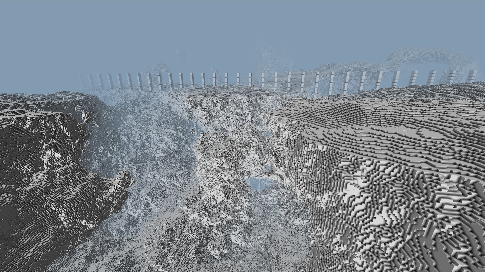

# Blocking
Blocking is an unfinished JavaScript block engine.

Online version: <https://rexirl.net/gfx/blocking/>

Use the cursor to look around, and to access the controls menu in the upper right corner.
Keyboard shortcuts: WASD for horizontal movement, RF for vertical movement, Escape to release the cursor from looking around.

